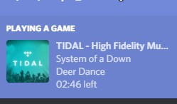

## TIDAL - Discord Rich Presence plug-in  (UNOFFICIAL)

Unofficial plug in to display current playing song to discord.

## Example Screenshot

### Instructions
Because TIDAL does not have a public api, It's not possible to get the current playing song,
except you connect your account to last.fm .

1.  Make sure you have connected your last fm account with TIDAL.

2.  Download the latest release from [here](https://github.com/purpl3F0x/TIDAL-Discord-Rich-Presence-UNOFFICIAL/releases)

3.  Run the .exe, The first time you run the script it will ask you to allow permition to access last.fm api and your username

4.  *Optional*: Place the exe in windows start-up folder to start when computer starts.

The scripts gets the information form last.fm so if you connect last.fm with your phone (or any other device that) and the script is running in your pc it will RPC will still work.

> Disclaimer: This project is Unofficial and it's not published from TIDAL.com &/ Aspiro.

---

#### Stavros Avramidis Never Settle & Keep Running